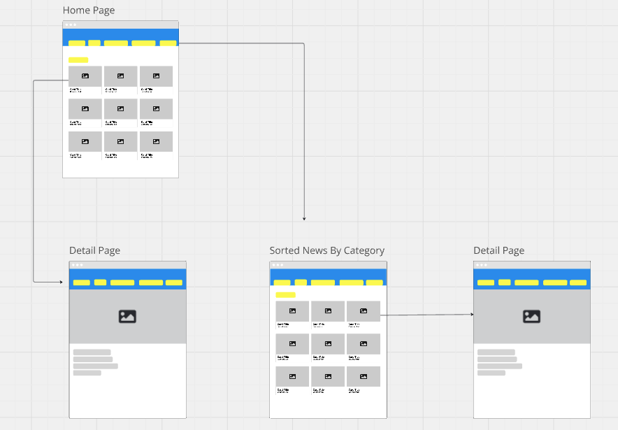

#  OsCorp Media

##  Overview:
 OsCorp Media is a news React app that lets users be informed about top headlines from BBC and gives the user to select news based on categories. Categories or interests like `sports`, `business`, `entertainment`, `general`, `health`, `science`, and `technology`. 

 ##  Installation:
1. Decide where you want to clone this repo in `YOUR` terminal.
2. Select the `Code` button and copy the `SSH` provided.
3. `YOUR` terminal command should look like the line below.
4. `git clone git@github.com:ZTFitru/osCorp-Media.git`
5. Move into the directory using `cd [dir_name]`.
6. Run `npm install` or `npm i` to install dependencies.

##  Testing:
1. In the terminal run `npc cypress open`
2. Select `E2E Testing`
3. Select `Chrome` and click on `Start E2E Testing in Chrome`
4. Create a new file and start testing

##  Preview of App:

##  Wireframe

##   Learning Goals:
- Have a strong understanding of React JS
- Have clean, well thought out code
- Prioritize user stories
- Understand basic usability practices and standards

##  Wins + Challenges:
Wins:
- Having fun being creative with the color selection and name of the project. 

Challenges:
-  After I got my data from the `API` there were some articles that were removed but still displayed on the screen. I had to use a filter in my fetch call to remove any article that had `[Removed]` in the title. 
- Doing extra research to grab the data I needed because the documentation did not supply a complete `GET` call when I wanted to sort the news I was getting by category.

##  Technologies: 

 

 

 

 

 

 

 
